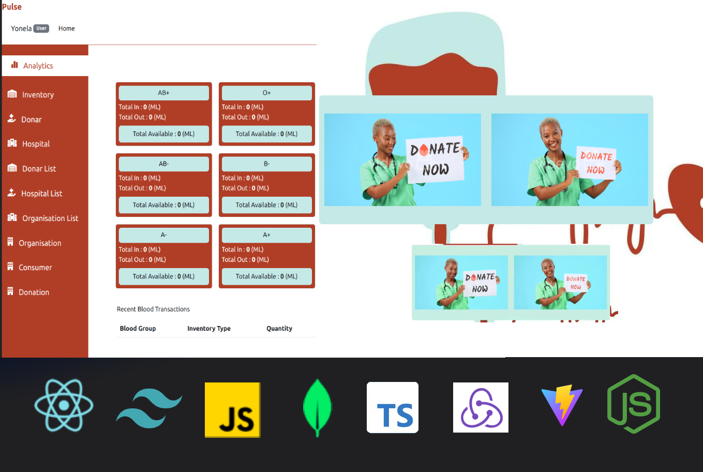

# Blood Donation MERN Website

## Pulse

## Introduction

Welcome to the Blood Donation MERN (MongoDB, Express, React, Node.js) website! This application serves as a platform for blood donation management, catering to users, admins, organizations, and hospitals. The system includes user registration, admin control, and insightful blood donation analytics.



## Demo

You can check out a live demo of the application [here](https://be-pleasered-by-pinky.vercel.app)


## Features

### User Registration
- Users can easily register on the platform.
- Collects necessary information for efficient blood donation coordination.

### Role-based Access
- **User:** Register, view upcoming events, and participate in blood donation drives.
- **Admin:** Manage users, organizations, hospitals, and view analytics.
- **Organization:** Coordinate and schedule blood donation events.
- **Hospital:** Request and manage blood donations for patients.

### Blood Donation Analytics
- Admins can access a dashboard with insightful analytics.
- Track donation trends, demographics, and event success rates.
- Visual representations for easy interpretation.

## Technologies Used

- **Frontend:**
  - React.js for the user interface.
  - Redux for state management.
  - Bootstrap for responsive design.
  - Tailwind
  - Redux

- **Backend:**
  - Node.js and Express for server-side logic.
  - MongoDB for data storage.

- **Authentication:**
  - JWT (JSON Web Tokens) for secure user authentication.

## Getting Started

1. Clone the repository.
   ```bash
   git clone https://github.com/yourusername/blood-donation-mern.git
